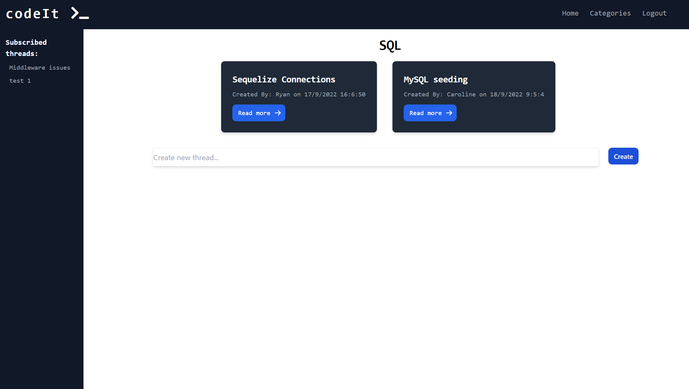

# codeIt

## Description

We have designed a social platform for individuals, who like us, have an interest in software development.

We wanted to create a place where they can go to discuss ideas and issues, with the ability to network by browsing and creating categories, subscribing to threads of interest, and posting within threads.

<br>

## Table of Contents

- [GitHub Link](#link)
- [Installation Instructions](#install-instructions)
- [Executing Instructions](#executing-instructions)
- [Database Information](#database-information)
- [Nodemailer](#nodemailer)
- [Screen Shots](#screen-shots)

---

## Link

The link to the GitHub repository of the project is <br>
[https://github.com/jkoufalas/codeIt](https://github.com/jkoufalas/codeIt)

---

## Install Instructions

The dependancies are listed within the package.json file. The dependancies for this application are

- sequelize
- dotenv
- mysql2
- expressjs
- handlebars
- express-handlebars
- nodemailer

Since the dependancies are listed within the lock file, they will autmatically installed with the following command

```
npm i
```

---

## Executing Instructions

```
node server.js
```

Utilize the command prompts and the application will prompt you for any information it needs to fullfill the requests you have made.

---

## Database Information

The user must have a MySQL database installed on the machine they are running the application on.

The schema for the database is included in the db folder and can be included by running the command

```
mysql> source db/schema.sql
```

The seed data if required can be inserted into the database by using the index.js file in the seeds folder and inserted by running the command.

```
> node seeds/seed.js
```

The information used to connect to the database is currently implemented with the dotenv package. To include the correct information to connect to the database corretly the following the user needs to create a .env file and add the following data.

```
    DB_NAME="social_media_db"
    DB_PW="your_password"
    DB_USER="your_user"
    EMAIL_USER='email_address'
    EMAIL_PASSWORD='emails password'
```

If the user doesn't want to use the dotenv package, then they can simply replace these variable in the server.js file with the hard coded values that these variables are storing.

---

## Nodemailer

Currently nodemailer is implemented using Outlook365, this can be changed to use and service or manual SMTP. Outlook365 was used because it provided a free account that nodemailer could use as a service with details in heroku that would not matter.

## Screen Shots

### Home Screen


### Categories Screen


### Threads Screen



### Thread Screen


### Login/SignUp Screen


---
